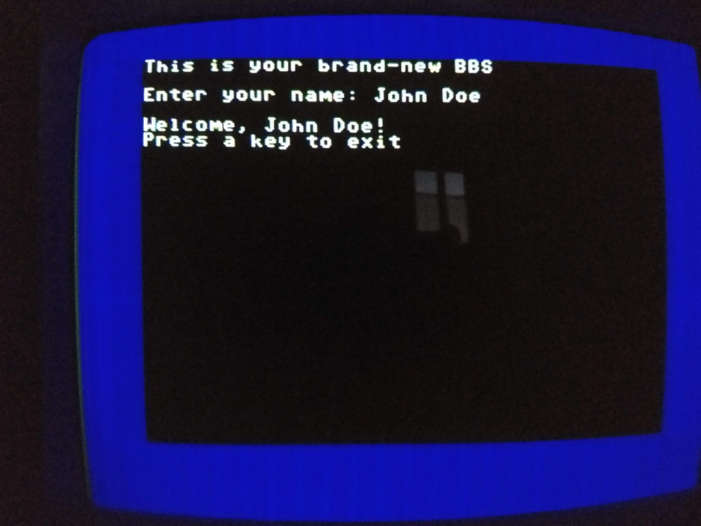

 

# PETSCII BBS Builder
A Java framework for building highly customizable **PETSCII**-enabled **BBS**es, accessible from 8-bit Commodore computers

## Purpose
This framework provides base classes for build your own **BBS** in PETSCII mode, accessibile through:
- a Commodore 64 with a [RR-NET](http://wiki.icomp.de/wiki/RR-Net) compatible card, running [KipperTerm](https://csdb.dk/release/index.php?id=174537)
- a Commodore 64 with a [WiFi modem card](http://www.codingkoala.com/kc64wifi/), running [CCGMS](https://csdb.dk/release/?id=156523)
- a Commodore 64/128 with a [1541Ultimate](http://www.1541ultimate.net), running [UltimateTerm](https://csdb.dk/release/?id=198112)
- an [Ultimate 64](https://ultimate64.com/), running [UltimateTerm](https://csdb.dk/release/?id=198112)
- a Commodore 64 with an [Easy Flash 3](http://store.go4retro.com/easyflash-3/) (with [CCGMS-EF](https://csdb.dk/release/?id=158760)) + a PC running [EF3USB](https://csdb.dk/release/?id=144900&show=notes)
- a common PC/Mac running [SyncTerm](https://sourceforge.net/projects/syncterm/) (*ConnectionType*=_Telnet_, *ScreenMode*=_C64_)

## System requirements
- Java Development Kit (JDK) and JRE version 1.8+
- A machine that will act as server

## Required skills
- Knowledge of Java language (compiler version 1.8+)
- BASIC TCP/IP concepts
- Knowledge of PETSCII encoding

## Getting started
Let's suppose to build a very simple BBS that asks your name welcomes you. The basic operation is to extend **PetsciiThread** class (or **AsciiThread** for ASCII BBS) implementing **doLoop()** method, such as:

    public class WelcomeBBS extends PetsciiThread {
        
        // NEVER forget default (empty) constructor
        public WelcomeBBS() {
            super(); // Recommended
        }
        
        @Override
        public void doLoop() throws Exception {
        
            // clear screen
            cls();
            
            println("This is your brand-new BBS");
            println();
            print("Enter your name: ");

            // flush output 
            flush();
            
            // clear input buffer
            resetInput();
            
            String name = readLine();
            println();
            println("Welcome, " + name + "!");
            println("Press a key to exit");
            flush();
            readKey();

        }
    }

this piece of code is enough to create a fully-functional but pretty simple BBS. The result will look like this:

All you have to do now is to build and run the BBS on your server, ready to be called by a **PETSCII**-enabled terminal client. Let's see how to do it in the following sections.

## Building the server
Once you have written your own BBS as an extension of *PetsciiThread* class, simply build the *fat jar* with this command:

    mvn clean package

The build process will result in the file **petscii-bbs.jar**, it will be found in the **target** directory. So you can run it with:

    java -jar target/petscii-bbs.jar

## Running the BBS Server
Running the server with no parameters, a help screen will be displayed:

    usage: target/petscii-bbs.jar
        --bbs <bbsName:port>   Run specific BBSes (mandatory - see list below)
                               in the form <name1>:<port1> <name2>:<port2> ...
     -h,--help                 Displays help
     -s,--serviceport <arg>    TCP port used by service process, 0 for
                               no-service (default 0)
     -t,--timeout <arg>        Socket timeout in millis (default 60 minutes)
    List of available BBS:
     * ...
     * WelcomeBBS

So we can rename the -jar file in **bbs.jar**, and the basic syntax for running our sample BBS is:

    java -jar bbs.jar --bbs WelcomeBBS:6510

the port where the service will run is **6510** and the timeout is **3600000** milliseconds by default (1 hour). We can change the timeout parameter with **-t** switch:

    java -jar bbs.jar --bbs WelcomeBBS:8088 -t 7200000
    
It's possible to run multiple BBSes, each one on a different port:

    java -jar bbs.jar --bbs WelcomeBBS:6510 NewsBBS:8400 SportsBBS:9100 -t 7200000
    
(so the port will be **8088** with a timeout of **2 hours**)

It's possibile to specify a "Service Port", which makes accessible (via web browser) the inspection of JVM running BBSes:

    java -jar bbs.jar --bbs WelcomeBBS:6510 NewsBBS:8400 SportsBBS:9100 -s 8080

### Keep it running
This **.jar** is intended to be a *server process*: it has to run all time. So, it's a good thing to run it in background if you use a *UNIX* shell using **nohup** command with bash **"&"** operator:

    nohup java -jar bbs.jar --bbs WelcomeBBS:6510 &

It's **VERY** important not to forget the final **&** symbol to keep it running. After launching that, you can logoff from your server.

### Stopping it
It's a plain process, so use plain **ps** and **kill** commands. If this *jar* is the **only one** running on your server, this command will do the work:

    killall java
    
## Sample BBSes in the package
You can study the sample BBSes (all classes that extend **PetsciiThread**) in the package **eu.sblendorio.bbs.tenants** as example of complete task. The package includes some proxies for accessing *WordPress* sites through Commodore 64 and a two classic strategy games (**tic-tac-toe** and **connect-4**) 

## Sample online BBSes
- **bbs.sblendorio.eu** - port **6510**
- **bbs.retrocampus.com** - port **6510**
 
## Credits
Thanks to:
- [**Antonino Porcino**](https://github.com/nippur72/c64-emu) for his browser-based PETSCII BBS Client emulator
- [**Brian W. Howell**](https://github.com/bigbhowell/tic-tac-toe) for the **tic-tac-toe** AI
- [**Felice Pagano**](https://github.com/felicepagano/) for code optimizations
- [**Henrik Wetterström**](http://droid64.sourceforge.net/) for **droid64** project, used to read and open D64 files
- [**Jatin Thakur**](https://github.com/jn1772/Connect4AI) for the **connect-4** AI
- [**Matteo Baccan**](https://github.com/matteobaccan) for code optimizations
- [**Piero Corasaniti**](https://github.com/corasaniti) for the *SD2IEC* version of CSDB tenant
- [**Richard Bettridge**](https://github.com/ssshake/theoldnet-bbs) for "Internet Browser" tenant
- [**Roberto Manicardi**](https://github.com/rmanicardi) for adapting ZMPP to BBS engine
- [**Wei-ju Wu**](http://zmpp.sourceforge.net/) for ZMPP, a Java implementation of Z-Machine (Infocom text adventures)

## Sample screenshot of the demo pack

